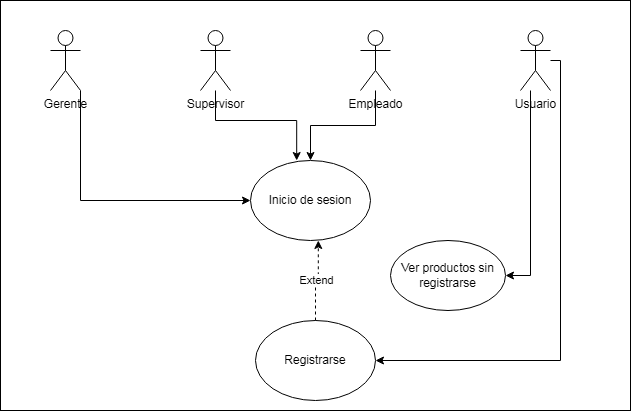

---
# PROYECTO FASE 1

---

<h1 align="center"> MANUAL TECNICO PROYECTO FASE 1</h1>

   
   

*Universidad de San Carlos de Guatemala*  
*Escuela de Ingeniería en Ciencias y Sistemas, Facultad de Ingenieria*  
*Analisis y Diseño de sistemas 2 2025.*  
*Seccion  - Grupo 2*  

| Nombre | Carnet |
| ------ | ------ |
|  Diego Andres Huite Alvarez| 202003585 |
|  Jorge Sebastian Zamora Polanco | 202002591 |
|  Lesther Kevin Federico López Miculax  | 202110897 |
|  Hugo Daniel Giron Garcia| 202004807 |
|  Genesis Nahomi Aparicio Acan | 202113293  |

___

## Índice

1. [Core del negocio](#1Core-del-negocio )
2. [Lista de requerimientos](#2Lista-de-requerimientos)
    1. [Requerimientos funcionales](#21Requerimientos-funcionales)
    2. [Requerimientos no funcionales](#21Requerimientos-no-funcionales)
3. [Diagrama de CDU expandidos](#3Diagrama-de-CDU-expandidos)
4. [Matrices de trazabilidad](#4Matrices-de-trazabilidad)
    1. [Stakeholders vrs Requerimientos](#41Stakeholders-vrs-Requerimientos)
    2. [RStakeholders vrs CDU](#42RStakeholders-vr-CDU)
    3. [Requerimiento vrs CDU](#43Requerimiento-vrs-CDU)
5. [Selección de patrón de arquitectura](#5Selección-de-patrón-de-arquitectura)
6. [Diagrama de bloques](#6Diagrama-de-bloques)
7. [Diagrama de despliegue](#7Diagrama-de-despliegue)
8. [Diagrama entidad relación](#8diagrama-entidad-relación)
9. [Prototipos](#9Prototipos)
10. [Patrones de diseño](#10Patrones-de-diseño)
11. [Tablero Kanban](#11Tablero-Kanban)

# 1. Core del Negocio
- Descripción

    El núcleo del negocio para la "Librería de Don Héctor" se centra en la gestión integral y optimizada de las operaciones del negocio, abarcando tanto la parte física como la digital. Se busca transformar y automatizar los procesos tradicionales, que se realizaban de forma manual, en un sistema que permita gestionar de manera centralizada y eficiente los siguientes aspectos:

    - Gestión de Inventario y Productos: Automatización en el registro, actualización y control de stock de los productos, evitando discrepancias en la disponibilidad y facilitando la identificación de productos obsoletos o de temporada.

    - Procesos de Ventas y Facturación: Implementación de un sistema que registre las ventas en tiempo real, genere facturas digitales y ofrezca un historial detallado de transacciones, lo que permite un mejor seguimiento y auditoría financiera.

    - Administración de Personal: Centralización de la información y gestión de roles para supervisores, empleados y gerentes. Esto incluye procesos de agregación , modificación y eliminación de perfiles, con un seguimiento a través de registros de auditoría.

    - Integración Digital y Experiencia del Cliente: Desarrollo de un portal en línea que complemente la operación física. Los usuarios podrán navegar por el catálogo de libros digitales, gestionar sus cuentas, agregar productos al carrito, dejar comentarios y calificaciones, y generar facturas digitales, lo cual amplía el alcance del negocio y mejora la experiencia del cliente.

    - Análisis y Reportes: Generación de reportes gráficos y analíticos que permitan evaluar el rendimiento de ventas, el margen de ganancia y otras métricas clave. Esta información es esencial para la toma de decisiones estratégicas y la planificación de futuras expansiones.

- Diagrama de CDU de Alto nivel con su primera descomposición
    - Inicio de sesion
        
    
    - Gestiones de Roles
        

##  2. Lista de requerimientos

### 2.1 Requerimientos funcionales 
- **RF01**: El sistema debe permitir el registro de nuevos empleados, solicitando los siguientes datos: nombre, apellido, CUI, teléfono, correo electrónico, edad, género, fecha de contratación y fotografía.

- **RF02**: El sistema debe enviar automáticamente un correo de confirmación al nuevo empleado con su contraseña de acceso y un enlace de verificación de cuenta.

- **RF03**: El sistema debe impedir que los empleados accedan a la plataforma si no han confirmado su cuenta a través del correo electrónico enviado.

- **RF04**: El sistema debe permitir la eliminación de empleados del sistema, registrando la causa de la eliminación en un historial de logs.

- **RF05**: El sistema debe almacenar un historial de empleados eliminados, incluyendo sus datos personales y la razón de su desvinculación, para futuras contrataciones.

- **RF06**: El sistema debe permitir la modificación de los datos de contacto de los empleados, siendo  el número de teléfono y el correo electrónico.

- **RF07**: El sistema debe permitir la consulta de la información de los empleados activos en la empresa.

- **RF08**: El sistema debe mostrar un historial de ventas de cada empleado en su perfil, detallando las transacciones realizadas durante el mes.

- **RF09**: El sistema debe permitir a los supervisores agregar nuevos productos al inventario, solicitando los siguientes datos: nombre del producto, descripción, código del producto, categoría, precio de compra, precio de venta, cantidad en inventario e imagen del producto.

- **RF10**: El sistema debe permitir la actualización de la información de los productos, incluyendo su descripción, precio de venta y stock disponible.

- **RF11**: El sistema debe permitir la eliminación de productos del inventario, registrando en un historial de logs los productos eliminados y la razón de su eliminación.

- **RF12**: El sistema debe permitir la visualización de todas las facturas emitidas por los empleados, mostrando detalles como la fecha de emisión, el nombre del empleado responsable, el nombre del cliente y los productos vendidos.

- **RF13**: El sistema debe permitir la búsqueda de facturas mediante filtros como fecha, empleado responsable y cliente.

- **RF14**: El sistema debe permitir a los supervisores acceder a las opiniones y comentarios de los clientes sobre los libros vendidos.

- **RF15**: El sistema debe almacenar la retroalimentación de los clientes con los siguientes datos: calificación, comentario y fecha de la reseña.

- **RF16**: El sistema debe permitir a los supervisores agregar nuevos libros al catálogo, ingresando los siguientes datos: título del libro, autor, fecha de lanzamiento, descripción, género, stock y precio.

- **RF17**: El sistema debe diferenciar entre libros físicos y digitales, permitiendo gestionar stock solo en el caso de libros físicos.

- **RF18**: El sistema debe permitir a los empleados iniciar sesión con el correo registrado y la contraseña enviada por correo electrónico al momento de su contratación.

- **RF19**: El sistema debe permitir a los empleados registrar ventas en el sistema, seleccionando los productos comprados y calculando el total de la compra.

- **RF20**: El sistema debe almacenar un historial de ventas registradas por cada empleado, incluyendo fecha, productos vendidos y total de la transacción.

- **RF21**: El sistema debe permitir a los empleados consultar la información de los productos en el inventario, incluyendo nombre, descripción, precio y stock disponible.

- **RF22**: El sistema debe permitir a los empleados generar recibos o facturas en formato PDF al finalizar cada compra.

- **RF23**: El sistema debe incluir en cada factura los siguientes datos: ID o código único, nombre del vendedor, fecha y hora de emisión, nombre de los productos, unidades compradas, precio total de cada producto, total de la venta y nombre del comprador.

- **RF24**: El sistema debe permitir la consulta de facturas emitidas previamente, facilitando la verificación de compras y la asistencia en caso de reclamos.

- **RF25**: El sistema debe permitir a los empleados registrar pagos en efectivo en el sistema.

- **RF26**: El sistema debe permitir a los usuarios navegar por el catálogo de libros sin necesidad de iniciar sesión, mostrando detalles como título, autor, precio y descripción.

- **RF27**: El sistema debe permitir el registro de nuevos usuarios, solicitando los siguientes datos: correo electrónico, contraseña, nombre completo y edad.

- **RF28**: El sistema debe enviar un correo de confirmación a los nuevos usuarios para verificar su cuenta antes de permitirles acceder a la plataforma.

- **RF29**: El sistema debe almacenar las contraseñas de los usuarios en la base de datos de forma encriptada.

- **RF30**: El sistema debe permitir a los usuarios iniciar sesión con su correo electrónico y contraseña.

- **RF31**: El sistema debe permitir a los usuarios administrar su lista de deseos, agregando y eliminando libros según su interés.

- **RF32**: El sistema debe permitir a los usuarios calificar libros y dejar comentarios sobre su experiencia de compra o lectura.

- **RF33**: El sistema debe permitir la modificación o eliminación de comentarios y calificaciones por parte del usuario.

- **RF34**: El sistema debe permitir la búsqueda de libros en la plataforma a través de filtros como título, autor, género y precio.

- **RF35**: El sistema debe permitir a los usuarios agregar libros al carrito de compras y gestionar su contenido antes de realizar la compra.

- **RF36**: El sistema debe permitir a los usuarios seleccionar entre dos métodos de pago: pago contra entrega o recogida en tienda.

- **RF37**: El sistema debe solicitar la dirección de entrega a los usuarios que seleccionen pago contra entrega.

- **RF38**: El sistema debe generar automáticamente una factura digital para cada compra realizada por un usuario y almacenarla en su perfil.

- **RF39**: El sistema debe permitir a los usuarios acceder a su historial de compras y consultar facturas anteriores.

- **RF40**: El sistema debe permitir a los usuarios ver una sección con los libros mejor valorados por otros usuarios, actualizándose dinámicamente según las calificaciones recibidas.

### 2.2 Requerimientos no funcionales 

- **RNF01**: El sistema debe ser seguro, protegiendo la información de los usuarios, empleados y clientes mediante cifrado de datos sensibles como contraseñas y datos de productos. Esto se logrará implementando algoritmos de encriptación como AES y protocolos de autenticación segura  en todas las transacciones de datos.

- **RNF02**: El sistema debe ser seguro, protegiendo la información de los usuarios, empleados y clientes mediante cifrado de datos sensibles como contraseñas y datos de productos. Esto se logrará implementando algoritmos de encriptación como AES y protocolos de autenticación segura  en todas las transacciones de datos.

- **RNF03**: El sistema debe permitir el restablecimiento seguro de contraseñas a través de un enlace único enviado por correo electrónico para verificar la identidad del usuario. Esto se logrará mediante un sistema de gestión de contraseñas que utilice autenticación basada en enlaces temporales y cifrado de la nueva contraseña antes de almacenarla en la base de datos.

- **RNF04**: El sistema debe contar con un control de acceso basado en roles, asegurando que solo los empleados con permisos adecuados tengan acceso a funciones críticas del sistema. Esto se logrará mediante la asignación de roles y permisos específicos a cada usuario dentro del sistema, permitiendo que solo aquellos con el rol adecuado puedan realizar ciertas acciones.

- **RNF05**: El sistema debe ser accesible desde dispositivos móviles, permitiendo a los usuarios y empleados interactuar con la plataforma desde teléfonos y tabletas. Esto se logrará mediante un diseño responsive que se adapte automáticamente a diferentes tamaños de pantalla, utilizando frameworks como Bootstrap o CSS Grid.

- **RNF06**: La interfaz de usuario debe ser intuitiva y fácil de navegar, permitiendo a los empleados y usuarios realizar tareas sin dificultad. Esto se conseguirá mediante el diseño de una interfaz clara, con botones visibles, menús bien estructurados y una organización lógica de las funciones dentro de la plataforma.

- **RNF07**: Los empleados deben poder generar facturas y recibos rápidamente, lo cual se garantizará mediante formularios predefinidos y una interfaz optimizada que permita emitir documentos con pocos pasos, utilizando plantillas automáticas que minimicen la entrada manual de datos.

- **RNF08**: Los usuarios deben poder realizar compras sin dificultades, con un proceso de pago claro y fácil de seguir. Esto se logrará mediante una interfaz sencilla con formularios de pago bien diseñados y pasos de compra que guíen al usuario sin confusión

- **RNF09**: El sistema debe realizar copias de seguridad automáticas de la base de datos al menos una vez al día. Esto se logrará implementando un sistema de backups automáticos que almacene las copias en servidores remotos o en la nube, asegurando la recuperación rápida en caso de pérdida de datos.

- **RNF010**: El sistema debe permitir la adición de nuevas funcionalidades sin afectar a las existentes. Esto se garantizará mediante la adopción de un enfoque modular en el desarrollo, utilizando frameworks que favorezcan la extensión de funcionalidades sin interrumpir el funcionamiento del sistema actual.

- **RNF11**: El sistema debe ser fácil de mantener, permitiendo que los administradores puedan realizar actualizaciones, correcciones y mejoras sin interrumpir el servicio. Esto se logrará implementando un sistema de control de versiones, como Git, que permita gestionar cambios en el código de manera ordenada y la integración de nuevas funcionalidades sin afectar las existentes.

- **RNF12**: El sistema debe garantizar la consistencia de los datos en todas las transacciones, evitando la pérdida de información. Esto se logrará utilizando bases de datos transaccionales que implementen propiedades ACID, garantizando que las operaciones sean seguras y se mantenga la integridad de los datos.

- **RNF13**: El sistema debe garantizar que no haya registros duplicados en la base de datos, especialmente en el inventario y las transacciones. Esto se logrará mediante la implementación de restricciones de unicidad en la base de datos, así como procesos de validación de datos en el backend para prevenir la creación de registros repetidos.

## 3 Diagrama de CDU expandidos
### [CDU Extendido](./CDU_extendido.md)

## 4 Matrices de trazabilidad

### Stakeholders vs Requerimientos

| Stakeholder               | Requerimientos Relacionados |
|---------------------------|----------------------------|
| **GERENTE (DON HÉCTOR)**  | Agregar, eliminar y modificar supervisores,Generar reportes de ventas y ganancias, Visualizar facturas emitidas, Supervisar el desempeño de empleados y supervisores, Recibir notificaciones automáticas (ej: correo de bienvenida a nuevos supervisores). |
| **SUPERVISOR (JOSÉ Y SU HERMANOS)**   | Agregar, eliminar y modificar empleados, Gestionar productos (agregar, actualizar, eliminar), Visualizar facturas emitidas por empleados, Acceder a reportes de ventas y comentarios de clientes, Recibir notificaciones automáticas (ej: confirmación de registro de empleados). |
| **EMPLEADO (FAMILIARES Y PERSONAS EXTERNAS)** | Iniciar sesión con credenciales seguras, Registrar ventas y generar facturas, Consultar información de productos en inventario, Gestionar métodos de pago (efectivo), Acceder a historial de ventas y facturas emitidas. |
| **USUARIO en plataforma**| Registrarse y confirmar cuenta mediante correo electrónico, Iniciar sesión y recuperar contraseña, Navegar y buscar libros digitales, Agregar libros al carrito y gestionar lista de deseos, Calificar y comentar libros, Elegir método de pago (contra entrega o recoger en tienda), Generar y descargar facturas digitales.  |

### Stakeholders vs CDU

| Stakeholder               | CDU Relacionados |
|---------------------------|------------------|
| **GERENTE (DON HÉCTOR)** | Agregar nuevo supervisor, Eliminar supervisor, Modificar información de supervisores, Ver reportes de ventas y ganancias, Visualizar facturas emitidas, Supervisar actividades de empleados y supervisores. |
| **SUPERVISOR (JOSÉ Y SU HERMANOS)**    | Agregar nuevo empleado, Eliminar empleado, Modificar información de empleados, Agregar, actualizar y eliminar productos, Visualizar facturas emitidas por empleados, Revisar comentarios y calificaciones de clientes. |
| **EMPLEADO (FAMILIARES Y PERSONAS EXTERNAS)** |  Iniciar sesión, Registrar venta, Consultar información de productos, Generar factura o recibo, Ver historial de facturas emitidas, Gestionar métodos de pago (efectivo) |
| **USUARIO en plataforma**| Registrarse en la plataforma, Iniciar sesión, Buscar libros por título, autor o género, Agregar libros al carrito, Gestionar lista de deseos, Calificar y comentar libros, Realizar compra y seleccionar método de pago, Descargar factura digital |

### Requerimiento vs CDU

| **Requerimiento**                                                                 | **CDU Relacionados**                                                                 |
|-----------------------------------------------------------------------------------|-------------------------------------------------------------------------------------|
| **Requerimientos del Gerente (Don Héctor)**                                       |                                                                                     |
| - Agregar, eliminar y modificar supervisores.                                     | - Agregar nuevo supervisor. - Eliminar supervisor. - Modificar información de supervisores. |
| - Generar reportes de ventas y ganancias.                                         | - Ver reportes de ventas. - Ver reportes de ganancias.                           |
| - Visualizar facturas emitidas.                                                   | - Visualizar facturas emitidas.                                                     |
| - Supervisar el desempeño de empleados y supervisores.                            | - Supervisar actividades de empleados y supervisores.                               |
| - Recibir notificaciones automáticas (ej: correo de bienvenida a nuevos supervisores). | - Enviar correo de bienvenida a nuevos supervisores.                                |
| **Requerimientos del Supervisor (José y sus hermanos)** ||
| - Agregar, eliminar y modificar empleados.                                        | - Agregar nuevo empleado. - Eliminar empleado. - Modificar información de empleados. |
| - Gestionar productos (agregar, actualizar, eliminar).                            | - Agregar nuevo producto. - Actualizar producto. - Eliminar producto.         |
| - Visualizar facturas emitidas por empleados.                                     | - Visualizar facturas emitidas por empleados.                                       |
| - Acceder a reportes de ventas y comentarios de clientes.                         | - Ver reportes de ventas. - Revisar comentarios y calificaciones de clientes.    |
| - Recibir notificaciones automáticas (ej: confirmación de registro de empleados). | - Enviar correo de confirmación a nuevos empleados.                                 |
| **Requerimientos del Empleado (Familiares y personas externas)**                  |                                                                                     |
| - Iniciar sesión con credenciales seguras.                                        | - Iniciar sesión.                                                                   |
| - Registrar ventas y generar facturas.                                            | - Registrar venta. - Generar factura o recibo.                                   |
| - Consultar información de productos en inventario.                               | - Consultar información de productos.                                               |
| - Gestionar métodos de pago (efectivo).                                           | - Gestionar métodos de pago.                                                        |
| - Acceder a historial de ventas y facturas emitidas.                              | - Ver historial de facturas emitidas.                                               |
| **Requerimientos del Usuario en  plataforma plataforma** |                                                                         
| - Registrarse y confirmar cuenta mediante correo electrónico.                     | - Registrarse en la plataforma. - Confirmar cuenta mediante correo.              |
| - Iniciar sesión y recuperar contraseña.                                          | - Iniciar sesión. - Recuperar contraseña.                                        |
| - Navegar y buscar libros digitales.                                              | - Buscar libros por título, autor o género.                                         |
| - Agregar libros al carrito y gestionar lista de deseos.                          | - Agregar libros al carrito. - Gestionar lista de deseos.                        |
| - Calificar y comentar libros.                                                    | - Calificar y comentar libros.                                                      |
| - Elegir método de pago (contra entrega o recoger en tienda).                     | - Seleccionar método de pago.                                                       |
| - Generar y descargar facturas digitales.                                         | - Generar factura digital. - Descargar factura digital.                          |

## 5. Selección de patrón de arquitectura
#### Modelo cliente-servidor

Se escogió esta arquitectura ya que permite separar las responsabilidades en tres distintas partes: vista, modelo y controlador.
La vista se encarga de mostrarle toda la información al usuario y de brindarle interactividad.
El modelo es responsable de almacenar los datos y de representar las reglas del negocio.
Al controlador se le delega la responsabilidad se actuar como intermediario entre la vista y el modelo, siendo este parte clave para asegurar la correcta interacción entre vista-modelo. El controlador se encarga de transmitir los datos de la vista al modelo y de obtener información del modelo y enviarlo a la vista.

Consideramos como grupo que es la mejor arquitectura a escoger ya que también es fácil de mantener y de trabajar con ella. Y permite trabajar con varios patrones de diseño y modularizar el código.

## Diagrama de bloques

### Diagrama de bloques que represente la arquitectura implementada

## 7. Diagramas de despliegue-componentes
- Despliegue
  

- Componentes
  

- Despliegue-componentes
  

  

## 8. Modelo Entidad Relacion

## 9 Prototipos
[prototipos realizados](https://github.com/SeZamora/AYD2_B_1S2025_PROYECTO_G2/blob/feature/202113293/Prototipos/Prototipos.md)

## 11. Tablero Kanban

Este tablero de divide cada uno por los módulos establecidos en el enunciado (supervisor, empleado, etc...)

